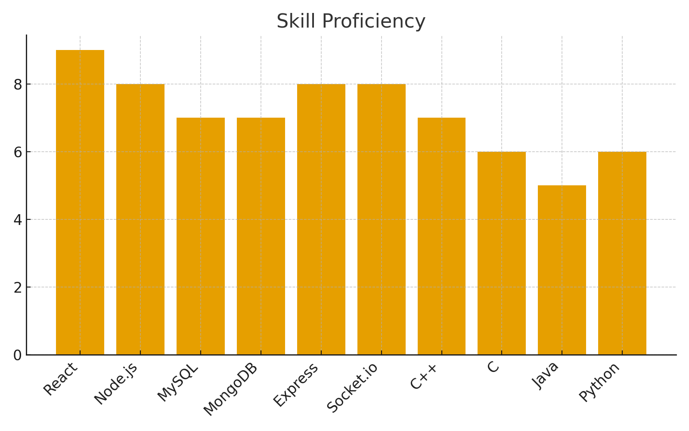

# 👋 Hi, I'm **Subrat Singh**

### 🚀 React Full Stack Developer

Versatile React developer with strong experience in frontend & backend development.  
Passionate about system design, networking, and building clean user interfaces.

---

## 🛠️ Skills Overview

### 📊 Skill Proficiency

---

## 🧰 Technical Skills

- **Frontend:** React, HTML, CSS, TypeScript  
- **Backend:** Node.js, Express.js  
- **Database:** MySQL, MongoDB  
- **Other Tools:** UI/UX, Socket.io, Recoil  
- **Programming Languages:** C++, C, Java, Python  

---

## 🎓 Education

**BCA** — Chhatrapati Shahu Ji Maharaj University  
*2024 – Present | Kanpur, Uttar Pradesh, India*

---

## 📜 Certificates

- Front End Development – HTML (Great Learning)  
- Solutions Architecture – AWS  
- Web Scraping with Node.js – SkillEcted  

---

## 🏆 Achievements

- **Hackathon (02/2024):** Secured **2nd place** in college hackathon  

---

## ❤️ Interests

- Listening to audiobooks (*Deep Work, Think & Grow Rich, Power of Habit*)  
- Solving puzzles  
- Writing code  
- Exploring technical concepts  

---

## 🔗 Connect with Me

- **Email:** subratsingh777@gmail.com  
- **LinkedIn:** https://www.linkedin.com/in/subrat-singh-9735bb243  
- **GitHub:** https://github.com/SubratSinghRathore  

---

⭐ *Thanks for visiting my profile!*
