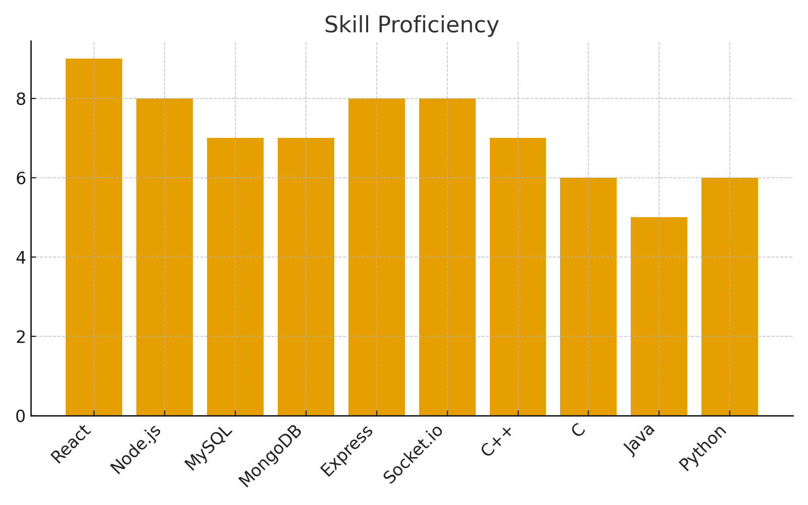

# 👋 Hi, I'm **Subrat Singh**

### Full-Stack Developer · React · Node.js · System Design

I’m a **Full-Stack Developer** focused on building scalable web applications, reliable backend systems, and clean, maintainable user interfaces.

I enjoy working across the stack—from designing React interfaces and REST APIs to database architecture, real-time communication, authentication, and system-level problem solving.

---

## 🚀 About Me

- 💻 Full-Stack Developer specializing in **React & Node.js**
- ⚙️ Experienced with **REST APIs, real-time systems, databases, and backend architecture**
- 🔌 Interested in **System Design, Networking, WebSockets, and distributed systems**
- 🧩 Strong focus on writing **clean, modular, and maintainable code**
- 🚀 Building and experimenting with production-oriented web applications
- 🎓 BCA student at **Chhatrapati Shahu Ji Maharaj University**

---

## 🛠️ Technical Skills

### Frontend
`React` `TypeScript` `JavaScript` `HTML5` `CSS3`

### Backend
`Node.js` `Express.js` `REST APIs` `Socket.io`

### Databases
`MongoDB` `MySQL`

### State & Architecture
`Recoil` `System Design` `API Design` `Real-Time Communication`

### Programming Languages
`C++` `C` `Java` `Python`

### Development Practices
`Git` `GitHub` `Debugging` `Problem Solving` `Networking`

---

## 🏗️ Engineering Focus

### 🔹 Full-Stack Development
Designing and developing complete web applications with modern frontend and backend technologies.

### 🔹 Backend Engineering
Building REST APIs, authentication flows, database integrations, request handling, and server-side business logic.

### 🔹 Real-Time Systems
Working with **WebSockets and Socket.io** for real-time communication, event-driven architectures, and live application updates.

### 🔹 System Design
Exploring scalability, caching, database design, networking, load handling, and communication between distributed components.

---

## 📊 Technical Proficiency

---

## 🎯 What I'm Currently Working On

- Building full-stack applications using **React + Node.js**
- Improving backend architecture and API design
- Learning advanced **System Design & Networking**
- Exploring scalable database architectures
- Working with real-time communication using **Socket.io**
- Improving application performance and reliability

---

## 🎓 Education

### Bachelor of Computer Applications (BCA)

**Chhatrapati Shahu Ji Maharaj University**  
Kanpur, Uttar Pradesh, India  
**2024 – Present**

---

## 📜 Certifications

- **Front End Development – HTML** — Great Learning
- **Solutions Architecture – AWS**
- **Web Scraping with Node.js** — SkillEcted

---

## 🏆 Achievements

🥈 **2nd Place — College Hackathon**  
*February 2024*

---

## 🧠 Interests

- System Design & Software Architecture
- Computer Networking
- Backend Engineering
- Distributed Systems
- Problem Solving & Puzzles
- Technical Reading
- Building Side Projects

---

## 📚 Currently Learning

`Advanced System Design` · `Scalable Backend Architecture` · `Cloud Computing` · `Networking` · `Database Optimization`

---

## 🔗 Connect With Me

📧 **Email:** subratsingh777@gmail.com

💼 **LinkedIn:** [linkedin.com/in/subrat-singh-9735bb243](https://www.linkedin.com/in/subrat-singh-9735bb243)

💻 **GitHub:** [github.com/SubratSinghRathore](https://github.com/SubratSinghRathore)

---

### ⭐ Thanks for visiting my profile!

*Always learning. Always building. Always improving.*
